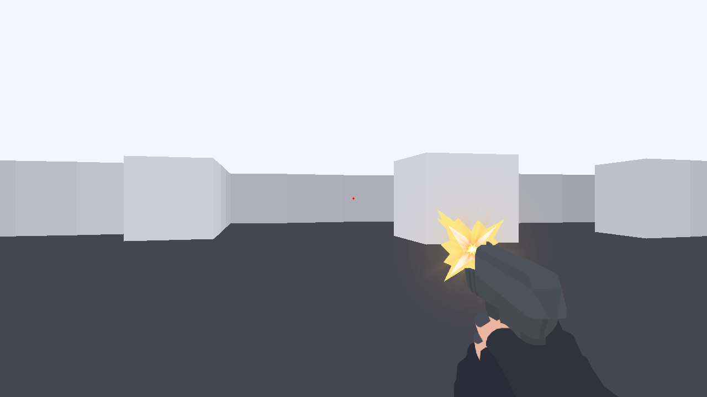
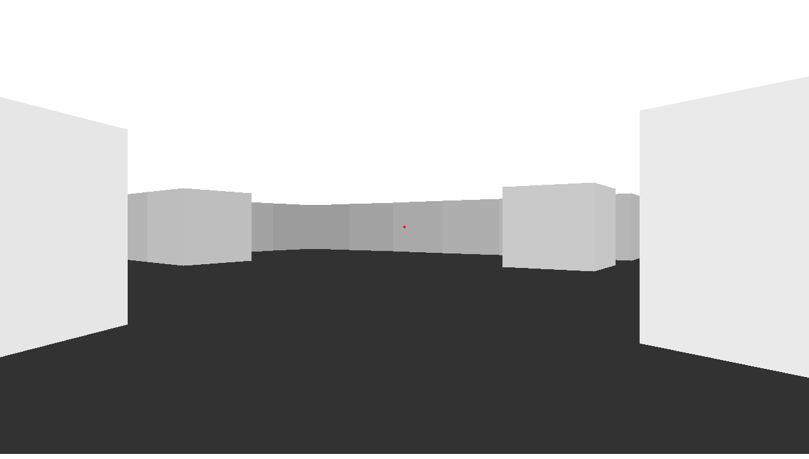
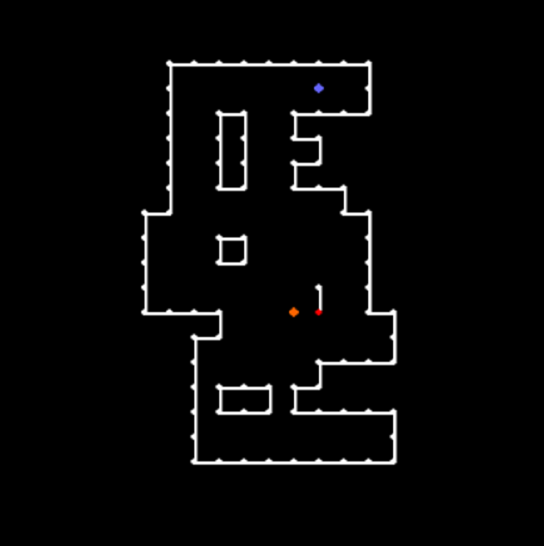
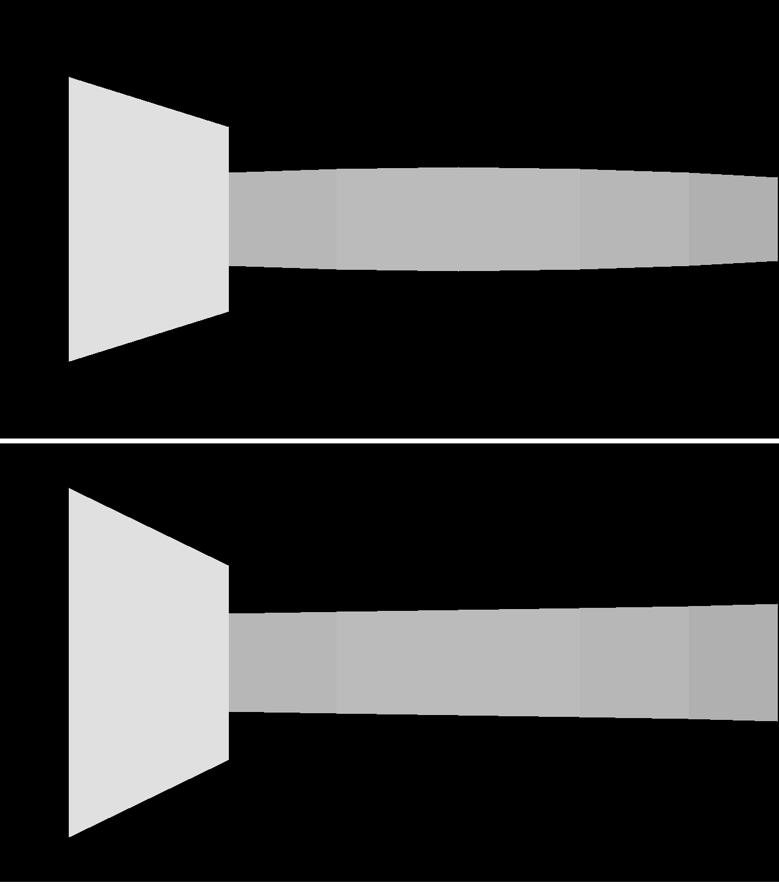
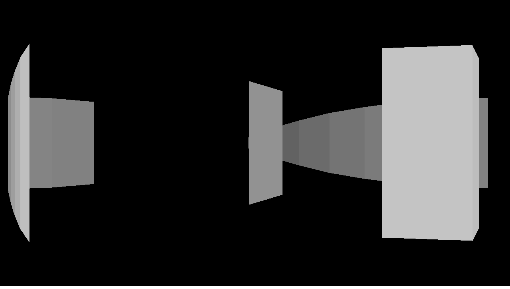
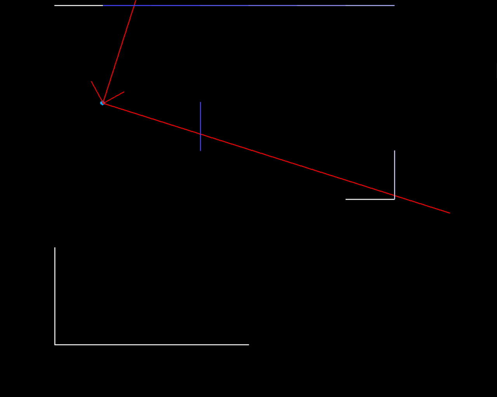
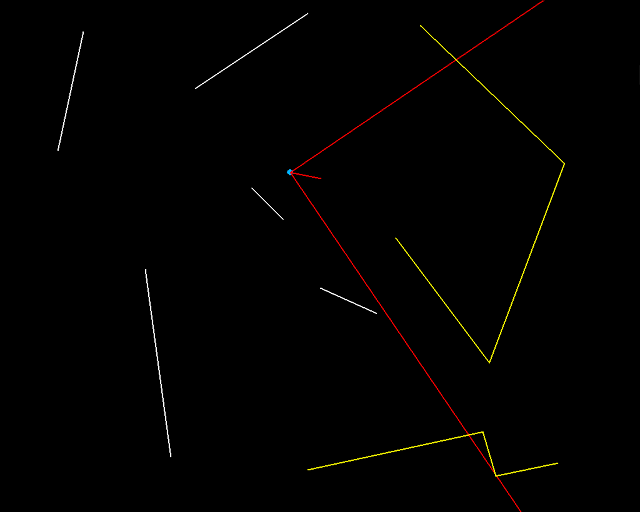
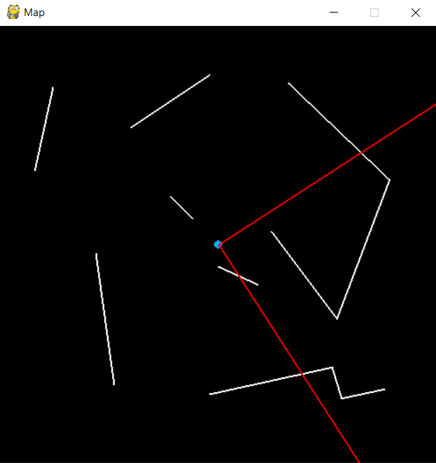

# First Person Shooter
FPS in Doom/Wolfenstein style.
Made to get more experience in Python and problem-solving

### v0.2.9
- Collor adjustments
- Added shooting with gun

### v0.2.8
- Added map editor (creating and saving simple maps - walls and player starting position)
- Adjustments to game rendering (few fixes, floor and ceiling, basic crosshair)
- Added sprinting forward with SHIFT
* There is still a minor bug where walls bend when close to the end of the screen

### v0.2.4
- Proper distance scaling with vertical FOV
- Fixed "fish eye" distortion

### v0.2
- Beginning of rendering in FPS style (need to work on scaling with distance)

### v0.1.6
- Added simple distance calculation

### v0.1.4
- Fixes and improvements to visible walls detection

### v0.1.2
- From now we can detect what walls are going to be visible
- Made movement relative to angle of player

### v0.1
- First representation

 
